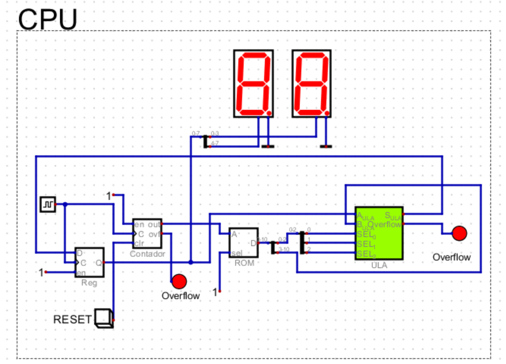
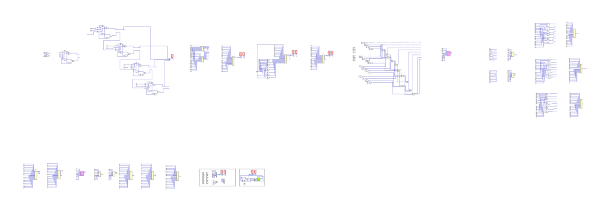

# CPU Simplificada de 8 bits

## 🎬 [Acesse o vídeo explicativo clicando aqui](https://youtu.be/P9vu5nvRbQE) 

## 📋 Sumário
1. [Introdução](#introdução)
2. [Visão Geral do Projeto](#visão-geral-do-projeto)
3. [Arquitetura da CPU](#arquitetura-da-cpu)
   - [Registrador Acumulador](#registrador-acumulador)
   - [Contador de Programa](#contador-de-programa)
   - [Memória ROM](#memória-rom)
   - [Unidade Lógica e Aritmética (ULA)](#unidade-lógica-e-aritmética-ula)
4. [Sistema de Instruções](#sistema-de-instruções)
5. [Fluxo de Dados](#fluxo-de-dados)
6. [Ciclo de Execução](#ciclo-de-execução)
7. [Interface de Saída](#interface-de-saída)
8. [Implementação](#implementação)
9. [Programação da ROM](#programação-da-rom)
10. [Testes e Resultados](#testes-e-resultados)
11. [Conclusão](#conclusão)

## 📝 Introdução

Esta documentação descreve uma implementação de CPU de 8 bits simplificada, desenvolvida no simulador de circuitos digitais "Digital". A CPU implementa uma arquitetura baseada em acumulador de ciclo único, capaz de executar um conjunto básico de operações aritméticas e lógicas.

    <h3>Figura 1: Imagem geral da Ula</h3>
    

        
    

    
<em>Fonte: Produzida pelo Autor (2025).</em>

## 🔭 Visão Geral do Projeto

A CPU simplificada de 8 bits foi desenvolvida como uma extensão natural da Unidade Lógica e Aritmética (ULA) previamente implementada. Ela transforma a ULA em um processador completo, capaz de buscar, decodificar e executar instruções armazenadas em memória. Você pode verificar a documentação completa da ULA clicando [aqui.](https://github.com/zzaved/Unidade-Aritmetica-e-Logica)

Características principais:
- Arquitetura baseada em acumulador
- Palavras de instrução de 11 bits (3 bits para código de operação + 8 bits para operando)
- Ciclo único de execução (busca e execução simultâneas)
- Oito operações suportadas (soma, subtração, multiplicação, shift right, shift left, AND, OR, XOR)
- Visualização dos resultados em display hexadecimal
- Indicador de overflow

## 🏗️ Arquitetura da CPU

A CPU implementa uma arquitetura Von Neumann simplificada, com os seguintes componentes principais:

### Registrador Acumulador
Um registrador de 8 bits que:
- Armazena um dos operandos para a ULA
- Recebe e armazena o resultado de cada operação
- Serve como o único registrador de uso geral da CPU

### Contador de Programa
Um contador de 2 bits que:
- Rastreia a próxima instrução a ser executada
- Incrementa automaticamente a cada ciclo de clock
- Endereça até 4 posições de memória (2² = 4)

### Memória ROM
Uma memória somente leitura que:
- Armazena o programa a ser executado
- Cada palavra tem 11 bits (3 bits para operação + 8 bits para operando)

### Unidade Lógica e Aritmética (ULA)
A ULA encapsulada como um circuito com:
- Entrada A: Recebe o valor do acumulador (8 bits)
- Entrada B: Recebe o operando da instrução (8 bits)
- Entradas SEL[2:0]: Recebem o código de operação (3 bits)
- Saída OUT: Produz o resultado da operação (8 bits)
- Saída OVERFLOW: Indica condições de overflow (1 bit)

## 📊 Sistema de Instruções

A CPU implementa 8 operações diferentes, codificadas nos 3 bits menos significativos da instrução:

| Código | Operação      | Função                                      |
|--------|---------------|---------------------------------------------|
| 000    | Soma          | Acumulador = Acumulador + Operando          |
| 001    | Subtração     | Acumulador = Acumulador - Operando          |
| 010    | Multiplicação | Acumulador = Acumulador × Operando          |
| 011    | Shift Right   | Acumulador = Acumulador >> Operando         |
| 100    | Shift Left    | Acumulador = Acumulador << Operando         |
| 101    | AND           | Acumulador = Acumulador & Operando          |
| 110    | OR            | Acumulador = Acumulador \| Operando         |
| 111    | XOR           | Acumulador = Acumulador ^ Operando          |

## 🔄 Fluxo de Dados

O fluxo de dados na CPU segue um padrão circular:

1. O contador de programa seleciona uma instrução na ROM
2. A instrução é dividida em código de operação (3 bits) e operando (8 bits)
3. O código de operação é enviado para a entrada SEL da ULA
4. O operando é enviado para a entrada B da ULA
5. O acumulador fornece o valor para a entrada A da ULA
6. A ULA executa a operação selecionada
7. O resultado é armazenado de volta no acumulador
8. O contador de programa incrementa para a próxima instrução

## ⏱️ Ciclo de Execução

A CPU opera em um ciclo de execução simplificado:

1. **Busca**: A instrução é lida da memória no endereço apontado pelo contador de programa
2. **Decodificação**: A instrução é dividida em código de operação e operando
3. **Execução**: A ULA realiza a operação
4. **Armazenamento**: O resultado é salvo no acumulador
5. **Incremento**: O contador de programa avança para a próxima instrução

Todos estes passos ocorrem simultaneamente em um único ciclo de clock, caracterizando um processador de ciclo único.

## 🖥️ Interface de Saída

A CPU possui duas formas de saída visual:

1. **Display Hexadecimal**: Dois displays de 7 segmentos mostram o valor atual do acumulador em formato hexadecimal (00-FF)
2. **LED de Overflow**: Um LED que acende quando uma operação resulta em overflow

## 🛠️ Implementação

A implementação física da CPU no simulador inclui:

- **Conexões de Clock**: Sincronizam o contador de programa e o registrador acumulador
- **Distribuidores**: Separam a instrução em seus componentes e conectam os barramentos de múltiplos bits
- **Multiplexador**: Implementa a lógica de seleção entre diferentes operações
- **Circuito de Reset**: Permite reiniciar a execução do programa

## 💾 Programação da ROM

A ROM foi programada com uma sequência de instruções para demonstrar as várias operações:

| Endereço | Valor (Hex) | Operação                             | Resultado Esperado (Hex) |
|----------|-------------|--------------------------------------|--------------------------|
| 0x0      | 0x50        | Soma 10 ao acumulador (0)           | 0A                       |
| 0x1      | 0x12        | Multiplica o acumulador (10) por 2  | 14                       |
| 0x2      | 0x0C        | Shift Left do acumulador (20) por 1 | 28                       |
| 0x3      | 0x7D        | AND entre acumulador (40) e 15      | 08                       |

Este programa demonstra uma sequência de operações aritméticas, de deslocamento e lógicas.

## ✅ Testes e Resultados

A CPU foi testada executando o programa armazenado na ROM. Os resultados observados no display de 7 segmentos confirmaram o funcionamento correto:

1. Após a primeira instrução: Display mostrou "0A" (10 em decimal)
2. Após a segunda instrução: Display mostrou "14" (20 em decimal)
3. Após a terceira instrução: Display mostrou "28" (40 em decimal)
4. Após a quarta instrução: Display mostrou "08" (8 em decimal)

Estes resultados validam o funcionamento correto da CPU, demonstrando sua capacidade de buscar, decodificar e executar instruções sequencialmente.

## 🏁 Conclusão

Esta CPU simplificada demonstra os princípios fundamentais de design de processadores digitais. Apesar de suas limitações (memória limitada, conjunto reduzido de instruções, arquitetura de ciclo único), ela implementa todos os componentes essenciais de um processador funcional.

A implementação bem-sucedida desta CPU representa um avanço significativo na compreensão da arquitetura de computadores, construindo sobre a base estabelecida pela ULA e expandindo-a para um sistema completo de processamento de instruções.

A modularidade do design permite futuras expansões, como aumento da memória, implementação de mais instruções, ou adição de mais registradores para melhorar a flexibilidade do processador.

    <h3>Figura 2: Imagem geral do desenvolvimento da Ula</h3>
    

        
    

    
<em>Fonte: Produzida pelo Autor (2025).</em>

